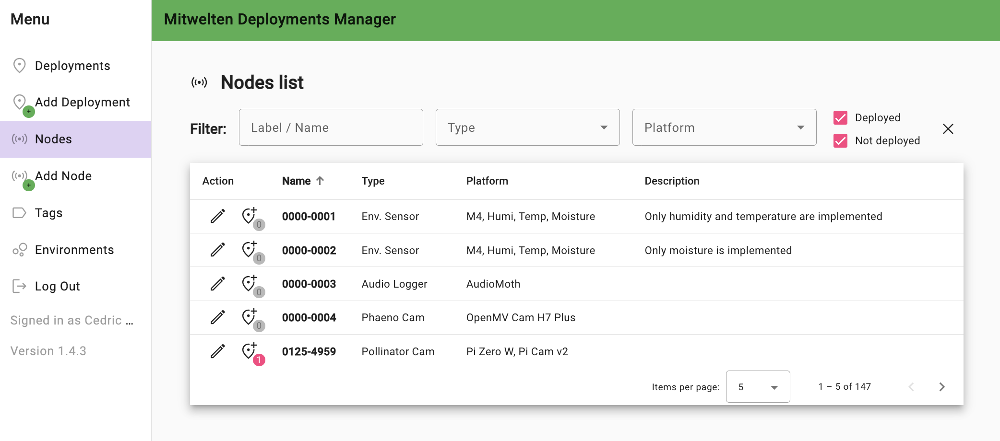
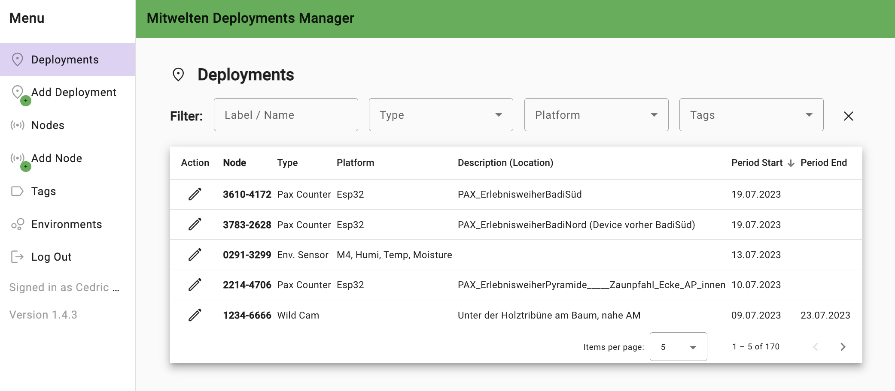

# Mitwelten Deployment Manager

WebApp to manage deployments of hardware nodes (sensors, cameras, etc.).

## Nodes

A node associates a unique label / ID (like `4242-2323`) to a hardware device.
The node record stores data on type, technical specifications, serial numbers,
and simiar identifiers.

The menu-iterm _Nodes_ and the route `/nodes` shows a list of all nodes.
Use the filter form on top to narrow down the list.
Filter options: Label / ID, node type (like _audio_),
platform (like _Audiomoth_), wether the not is/was ever deployed.

_Nodes list view_

To view details of a node, click on the corresponding list entry.
This view shows all details stored in the node record plus the full URL to
directly access those details. Click on the link to copy it to the clipboard.

_Node detail view_

To edit a node, click the pencil icon in the left column of the list.
Editing a node record only concerns the information related to the node itself,
not to its deployment.
The edit form can be used to delete the node as well.

To add a new node, use the _Add node_ menu item or the `node/add` route.
The _magic_ button auto-generates node labels in the correct format.

To deploy a node, click the _deploy node_ button in the left column of the list.
This will lead to the _deployment add/edit form_ (see below).

## Deployments

A deployment describes the location and timespan in which a specific node is deployed "_in the field_".
An optional description gives context to that deployment.
Tags are used to group deployments together.
Such a group of nodes could be 4 PoE cameras, A storage node and the 4G accesspoint used to connect those nodes and provide internet connectivity.
In that case a tag describing the setup/location briefly would be added to all
corresponding nodes.

The menu-iterm _Deployments_ and the route `/deploymnets` shows a list of all deployments.
Simiar to the nodes list, you may use the filter form on top to narriw down
the list of deployments. The fiter options include tags (for finding groups of deployments / nodes), node label / ID, node type and node platform.

_Deployments list view_

## Tags

work in progress

## Running / Building

- Run `ng serve` for a dev server. Navigate to `http://localhost:4200/`. The application will automatically reload if you change any of the source files.
- Run `ng build` to build the project. The build artifacts will be stored in the `dist/` directory.
